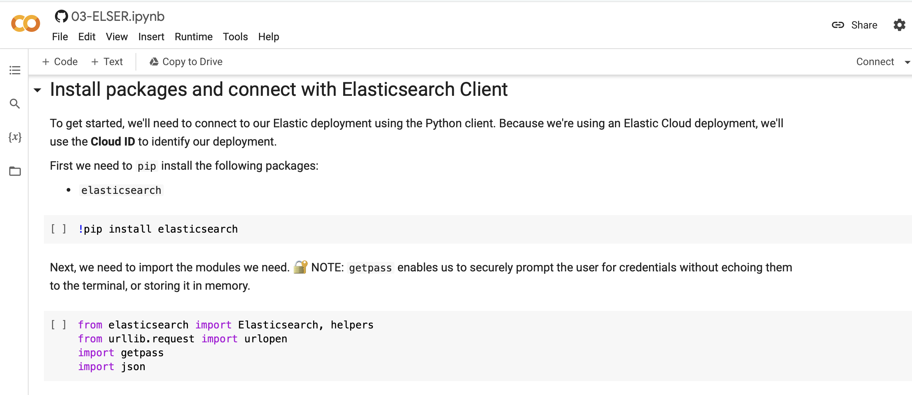

## Overview

Python notebooks, AKA Jupyter notebooks, are a mixture of Python code and markdown text.
Notebooks combine executable code and documentation to create interactive examples.
This is the best way to start testing Elasticsearch with our official Python client.

Here's an example of what a notebook UI looks like:

## Running notebooks

You can run notebooks locally using [Jupyter](https://jupyter.org/), but we recommend using a free hosted service like [Google Colab](https://colab.research.google.com/).
Colab runs notebooks in a self-contained virtual environment, so you don't need to worry about setting up and managing a local Python environment.

Colab can run any notebook hosted in a public GitHub repo, making it easy to test, share, and review notebooks.

## Elasticsearch Labs notebooks

We have a number of notebooks available in the [Elasticsearch Labs repo](www.github.com/elastic/vector-gen-ai/tree/main/notebooks).
Feel free to jump right in and try them out, or check out our <DocLink id="genaiQuickStart"/> for a little more guidance.

Notebooks are organized into the following folders:

- [`search`](https://github.com/elastic/elasticsearch-labs/tree/main/notebooks/search/): Notebooks that demonstrate the fundamentals of Elasticsearch, like indexing embeddings, running lexical, semantic and _hybrid_ searches, and more.

- [`generative-ai`](https://github.com/elastic/elasticsearch-labs/tree/main/notebooks/generative-ai/): Notebooks that demonstrate various use cases for Elasticsearch as the retrieval engine and vector store for LLM-powered applications.

- [`integrations`](https://github.com/elastic/elasticsearch-labs/tree/main/notebooks/integrations/): Notebooks that demonstrate how to integrate popular services and projects with Elasticsearch:
  - [OpenAI](https://github.com/elastic/elasticsearch-labs/tree/main/notebooks/integrations/openai)
  - [Hugging Face](https://github.com/elastic/elasticsearch-labs/tree/main/notebooks/integrations/hugging-face)
  - [LlamaIndex](https://github.com/elastic/elasticsearch-labs/tree/main/notebooks/integrations/llama-index)

- [`langchain`](https://github.com/elastic/elasticsearch-labs/tree/main/notebooks/langchain/): Notebooks that demonstrate how to integrate Elastic with [LangChain](https://langchain-langchain.vercel.app/docs/get_started/introduction.html), a framework for developing applications powered by language models.

