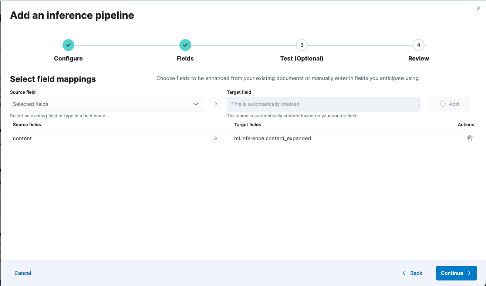

## Load the data

The best approach is to use Enterprise Search to create a new index and configure the ingest pipeline to enrich the data.

With Elastic 8.8+ , have at least 4GB of RAM available to the ML cable tier (or ML instances if using Elastic cloud)

From the landing page in Kibana, navigate to Enterprise Search.


### Create the index

Here, click on Create an Elasticsearch index and choose the API method.

Name the index `search-workplace` (notice the existing prefix `search-`), and click on Create index.

### Configure the ingest pipeline

On the index configuration screen, navigate to the Pipelines tab and click on Copy and customize.


Now click on Add Inference pipeline to configure the inference pipeline.

Name the inference pipeline `ml-inference-workplace` (notice the existing prefix `ml-inference-`) and select the ELSER model. Click continue.

You may need to go to the Maching Learning > Model Management > Trained Model section and 'deploy' the ELSER model if this is the first time you are using ELSER on this cluster.


On the next screen, add the fields `name` and `content` as custom options.


Then click on Continue.



Click Continue to review the changes and then Create pipeline.

### Run the script to ingest data

Go to the folder `data` and run the python script `index-data.py` to ingest the movies dataset.

In order to connect it to the correct Elastic Cloud instance, we need the default admin password you saved after creating the deployment and the Cloud ID for your deployment.

The Cloud ID for your deployment can be found by navigating to the Kibana menu and clicking on the Manage this deployment link. This will take you to the infrastructure management page in Elastic Cloud. Look for the Cloud ID on that page (surrounded by a red box in the screenshot). There is a button at the end of it that you can use to copy the value to the clipboard.


```sh
# Skip this if you already have installed the script dependencies
python3 -m venv .venv
source .venv/bin/activate
pip install -r requirements.txt

# Run the script
python3 index-data.py --es_password=<ELASTICSEARCH_PASSWORD> --cloud_id=<CLOUD_ID>
```

- ELASTICSEARCH_PASSWORD: Use the default admin password previously saved
- CLOUD_ID: See instructions above to retrieve it

If you have followed the instructions in the main README and set up a .env file for the python flask api, you can se the ```load-data.sh``` script.

# Loading custom data
Below is an example of modifications necessary to quickly make a quick customer demo using copy-and-pasted infomration from their public FAQ. In this example I used 12 FAQ articles from the US Social Security Administration's page about Medicare.

## Create an index

Use the same **Kibana > Enterprise Search > Elasticsearch > Indices > + Create a new index** workflow to make an index, and configure the ELSER enrichment pipeline on the **name** and **content** fields.

I named my new index search-medicare

## Create a new data file

I've uploaded an example of a custom data file [here: medicare.json](./medicare.json). Nothing fancy here. The sample UI can be fragile, so all fields are required.

## Upload the data

I made an example load-medicare.sh script so that I could reload the data quickly. It's easier to delete the previous documents than delete the index. Don't do this on a real system, but delete-by-query is your friend (vs having to recreate the various inference pipelines)

``` json
POST /search-medicare/_delete_by_query
{
  "query": {
    "match_all": {}
  }
}
```

## Change the index being used by the api for search

Change the two instances of "search-workplace" to "search-medicare" in api/app.py

## Test the UI

Restarting the API should change the UI to pull from the medicare data

## Modify the UI for your use case

You should now be able to test the UI and interact with the new data. I made a FAQ icon in the source code for the front end, but you can quickly add a new "category" icon by editing the code 

```frontend/src/components/source_icon.tsx```

and adding an icon image to 

```frontend/src/images```

You can change the default suggestions under the search bar in 

```frontend/src/App.tsx```


