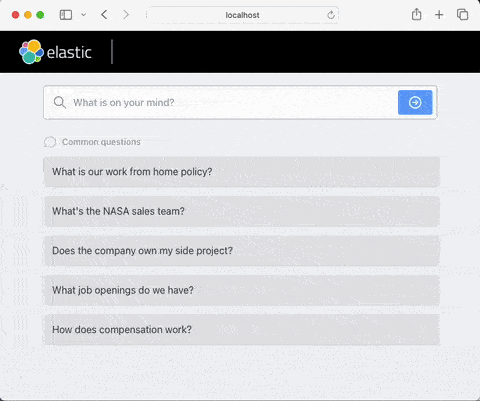

# Elastic Chatbot RAG App

This is a sample app that combines Elasticsearch, Langchain and a number of different LLMs to create a chatbot experience with ELSER with your own private data.

**Requires at least 8.11.0 of Elasticsearch.**



## Download the Project

Download the project from Github and extract the `chatbot-rag-app` folder.

```bash
curl https://codeload.github.com/elastic/elasticsearch-labs/tar.gz/main | \
tar -xz --strip=2 elasticsearch-labs-main/example-apps/chatbot-rag-app
```

## Make your .env file

Copy [env.example](env.example) to `.env` and fill in values noted inside.

## Installing and connecting to Elasticsearch

There are a number of ways to install Elasticsearch. Cloud is best for most
use-cases. We also have [docker-compose-elastic.yml][docker-compose-elastic],
that starts Elasticsearch, Kibana, and APM Server on your laptop in one step.

Once you decided your approach, edit your `.env` file accordingly.

For more information, visit our [Install Elasticsearch][install-es] tutorial.

## Connecting to LLM

We support several LLM providers, but only one is used at runtime, and selected
by the `LLM_TYPE` entry in your `.env` file. Edit that file to choose an LLM,
and configure its templated connection settings:

* azure: [Azure OpenAI Service](https://learn.microsoft.com/en-us/azure/ai-services/openai/)
* bedrock: [Amazon Bedrock](https://docs.aws.amazon.com/bedrock/)
* openai: [OpenAI Platform](https://platform.openai.com/docs/overview) and
  services compatible with its API.
* vertex: [Google Vertex AI](https://cloud.google.com/vertex-ai/docs)
* mistral: [Mistral AI](https://docs.mistral.ai/)
* cohere: [Cohere](https://docs.cohere.com/)

## Running the App

This application contains two services:
* create-index: Installs ELSER and ingests data into elasticsearch
* api-frontend: Hosts the chatbot-rag-app application on http://localhost:4000

There are two ways to run the app: via Docker or locally. Docker is advised for
ease while locally is advised if you are making changes to the application.

### Run with docker

Docker compose is the easiest way to get started, as you don't need to have a
working Python environment.

**Double-check you have a `.env` file with all your variables set first!**

```bash
docker compose up --pull always --force-recreate
```

*Note*: The first run may take several minutes to become available.

Clean up when finished, like this:

```bash
docker compose down
```

### Run with Kubernetes

Kubernetes is more complicated than Docker, but closer to the production
experience for many users. [k8s-manifest.yml](k8s-manifest.yml) creates the
same services, but needs additional configuration first.

First step is to setup your environment. [env.example](env.example) must be
copied to a file name `.env` and updated with `ELASTICSEARCH_URL` and
`OTEL_EXPORTER_OTLP_ENDPOINT` values visible to you Kubernetes deployment.

For example, if you started your Elastic Stack with [k8s-manifest-elastic.yml][k8s-manifest-elastic],
you would update these values:
```
ELASTICSEARCH_URL=http://elasticsearch:9200
OTEL_EXPORTER_OTLP_ENDPOINT=http://apm-server:8200
```

Then, import your `.env` file as a configmap like this:
```bash
kubectl create configmap chatbot-rag-app-env --from-env-file=.env
```

<details>
<summary>To use Vertex AI, set `LLM_TYPE=vertex` in your `.env` and follow these steps</summary>

The `api-frontend container` needs access to your Google Cloud credentials.
Share your `application_default_credentials.json` as a Kubernetes secret:
```bash
# Logs you into Google Cloud and creates application_default_credentials.json
gcloud auth application-default login
# Adds your credentials to a Kubernetes secret named gcloud-credentials
kubectl create secret generic gcloud-credentials \
  --from-file=application_default_credentials.json=$HOME/.config/gcloud/application_default_credentials.json
```
</details>

Now that your configuration is applied, create the `chatbot-rag-app` deployment
and service by applying this manifest:
```bash
kubectl apply -f k8s-manifest.yml
```

Next, block until `chatbot-rag-app` is available.
```bash
kubectl wait --for=condition=available --timeout=20m  deployment/chatbot-rag-app
```

*Note*: The first run may take several minutes to become available. Here's how
to follow logs on this stage:
```bash
kubectl logs deployment.apps/chatbot-rag-app -c create-index -f
```

Next, forward the web UI port:
```bash
kubectl port-forward deployment.apps/chatbot-rag-app 4000:4000 &
```

Clean up when finished, like this:
```bash
kubectl delete -f k8s-manifest.yml
```

### Run with Python

If you want to run this example with Python, you need to do a few things listed
in the [Dockerfile](Dockerfile) to build it first. The below uses the same
production mode as used in Docker to avoid problems in debug mode.

**Double-check you have a `.env` file with all your variables set first!**

#### Build the frontend

The web assets are in the [frontend](frontend) directory, and built with yarn.

```bash
# Install and use a recent node, if you don't have one.
nvm install --lts
nvm use --lts
# Build the frontend web assets
(cd frontend; yarn install; REACT_APP_API_HOST=/api yarn build)
```

#### Configure your Python environment

Before we can run the app, we need a working Python environment with the
correct packages installed:

```bash
python3 -m venv .venv
source .venv/bin/activate
# Install dotenv which is a portable way to load environment variables.
pip install "python-dotenv[cli]"
pip install -r requirements.txt
```

#### Create your Elasticsearch index

First, ingest the data into elasticsearch:
```bash
dotenv run -- flask create-index
```

*Note*: This may take several minutes to complete

#### Run the application

Now, run the app, which listens on http://localhost:4000
```bash
dotenv run -- python api/app.py
```

## Advanced

### OpenTelemetry

If you set `OTEL_SDK_DISABLED=false` in your `.env` file, the app will send
logs, metrics and traces to an OpenTelemetry compatible endpoint.

This happens automatically, when using docker. If running with python directly,
prefix `python` with `opentelemetry-instrument` to enable OpenTelemetry.

```bash
dotenv run -- opentelemetry-instrument python api/app.py
```

[env.example](env.example) defaults to use Elastic APM server, started by
[docker-compose-elastic.yml](../../docker). If you start your Elastic stack
this way, you can access Kibana like this, authenticating with the username
"elastic" and password "elastic":

http://localhost:5601/app/apm/traces?rangeFrom=now-15m&rangeTo=now

Under the scenes, chatbot-rag-app is automatically instrumented by the Elastic
Distribution of OpenTelemetry (EDOT) Python. You can see more details about
EDOT Python [here](https://github.com/elastic/elastic-otel-python).

OpenTelemetry support for LLM providers not included in EDOT Python are provided
by the [Langtrace Python SDK](https://docs.langtrace.ai/sdk/python_sdk).

### Updating package versions

To update package versions, recreate [requirements.txt](requirements.txt) and
reinstall like this. Once checked in, any commands above will use updates.

```bash
rm -rf .venv requirements.txt
python3 -m venv .venv
source .venv/bin/activate
# Install dev requirements for pip-compile and edot-bootstrap
pip install pip-tools elastic-opentelemetry
# Recreate requirements.txt
pip-compile
# Install main dependencies
pip install -r requirements.txt
# Add opentelemetry instrumentation for these dependencies
edot-bootstrap >> requirements.txt
# Install opentelemetry dependencies
pip install -r requirements.txt
```

### Elasticsearch index and chat_history index

By default, the app will use the `workplace-app-docs` index and the chat
history index will be `workplace-app-docs-chat-history`. If you want to change
these, edit `ES_INDEX` and `ES_INDEX_CHAT_HISTORY` entries in your `.env` file.

### Indexing your own data

The ingesting logic is stored in [data/index_data.py](data/index_data.py). This
is a simple script that uses Langchain to index data into Elasticsearch, using
`RecursiveCharacterTextSplitter` to split the large JSON documents into
passages. Modify this script to index your own data.

See [Langchain documentation][loader-docs] for more ways to load documents.

### Running from source with Docker

To build the app from source instead of using published images, pass the
`--build` flag to Docker Compose instead of `--pull always`

```bash
docker compose up --build --force-recreate
```

---
[loader-docs]: https://python.langchain.com/docs/how_to/#document-loaders
[install-es]: https://www.elastic.co/search-labs/tutorials/install-elasticsearch
[docker-compose-elastic]: ../../docker/docker-compose-elastic.yml
[k8s-manifest-elastic]: ../../k8s/k8s-manifest-elastic.yml
