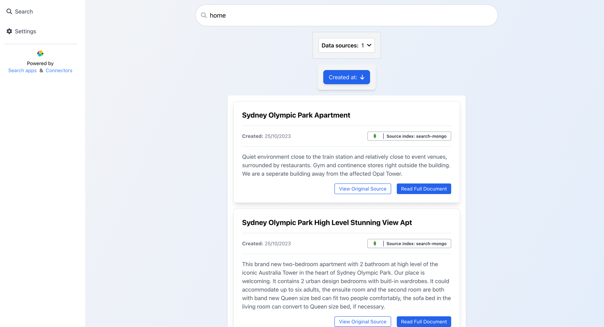

# Workplace Search Reference App

This application shows you how to build an application using [Elastic Search Applications](https://www.elastic.co/guide/en/enterprise-search/current/search-applications.html) for a Workplace Search use case.


The application uses the [Search Application Client](https://github.com/elastic/search-application-client). Refer to this [guide](https://www.elastic.co/guide/en/enterprise-search/current/search-applications-search.html) for more information.

## Running the application

### Configuring mappings (subject to change in the near future)

The application uses two mapping files (will be replaced with a corresponding UI in the near future).
One specifies the mapping of the documents in your indices to the rendered search result.
The other one maps a source index to a corresponding logo.

#### Data mapping

The data mappings are located inside [config/documentsToSearchResultMappings.json](src/config/documentsToSearchResultMappings.json).
Each entry maps the fields of the documents to the search result UI component for a specific index. The mapping expects `title`, `created`, `previewText`, `fullText`, and `link` as keys.
Specify a field name of the document you want to map for each key.

##### Example:

Content document:

````json
{
  "name": "Document name",
  "_timestamp": "2342345934",
  "summary": "Some summary",
  "fullText": "description",
  "link": "some listing url"
}
````

Mapping:
````json
{
  "search-mongo": {
    "title": "name",
    "created": "_timestamp",
    "previewText": "summary",
    "fullText": "description",
    "link": "listing_url"
  }
}
````

#### Logo mapping
You can specify a logo for each index behind the search application. Place your logo inside [data-source-logos](public/data-source-logos) and configure
your mapping as follows:

````json
{
  "search-index-1": "data-source-logos/some_logo.png",
  "search-index-2": "data-source-logos/some_other_logo.webp"
}
````

### Configuring the search application

To be able to use the index filtering and sorting in the UI you should update the search template of your search application:

`PUT _application/search_application/{YOUR_SEARCH_APPLICATION_NAME}`
````json
{
  "indices": [{YOUR_INDICES_USED_BY_THE_SEARCH_APPLICATION}],
  "template": {
    "script": {
      "lang": "mustache",
      "source": """
        {
          "query": {
            "bool": {
              "must": [
              {{#query}}
              {
                "query_string": {
                  "query": "{{query}}"
                }
              }
              {{/query}}
            ],
            "filter": {
              "terms": {
              "_index": {{#toJson}}indices{{/toJson}}
            }
            }
            }
          },
          "from": {{from}},
          "size": {{size}},
          "sort": {{#toJson}}sort{{/toJson}}
        }
      """,
      "params": {
        "query": "",
        "size": 10,
        "from": 0,
        "sort": [],
        "indices": []
      }
    }
  }
````

### Setting the environment variables

You need to set `REACT_APP_SEARCH_APP_NAME`, `REACT_APP_SEARCH_APP_API_KEY` and `REACT_APP_SEARCH_APP_ENDPOINT` inside [.env](.env) to the corresponding values, which you'll get when [creating a search application](https://www.elastic.co/guide/en/enterprise-search/current/search-applications.html).

