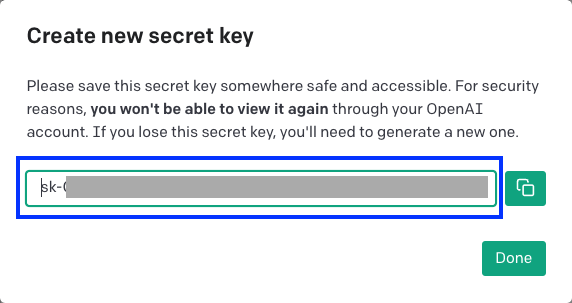
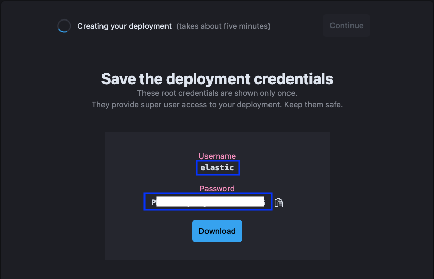
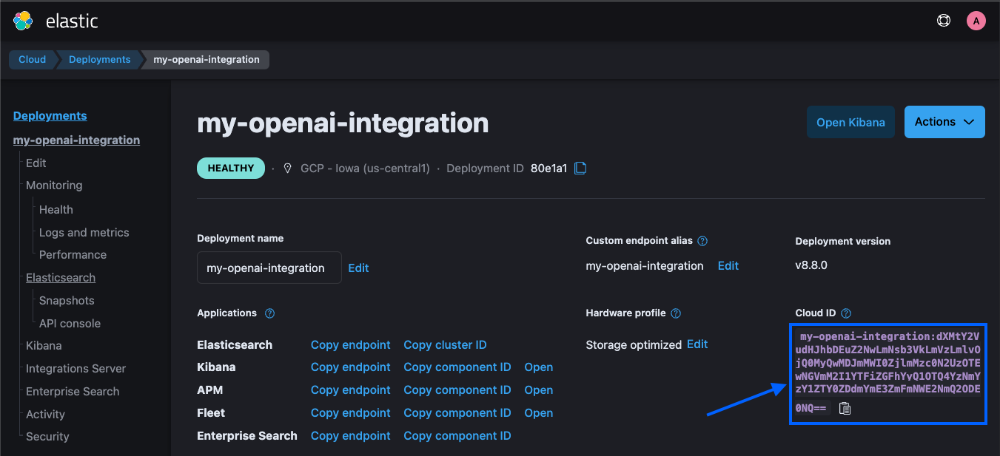

# Elastic OpenAI integration example - Python

## Overview

Small sample Python/Flask application to demonstrate how to integrate Elastic and OpenAI.

This folder includes two Python scripts:

- `generate_embeddings.py`: Processes a JSON file, generates text embeddings for each document in the file using OpenAI's API, and then stores the documents and their corresponding embeddings in an Elasticsearch index.
- `search_app.py`: A tiny Flask web app that renders a search bar, generates embeddings for search queries, and performs a semantic search using Elasticsearch's [kNN search](https://www.elastic.co/guide/en/elasticsearch/reference/current/knn-search.html). It retrieves the search results and returns a list of hits, ranked by relevance.

Both scripts use the [Elasticsearch](https://github.com/elastic/elasticsearch-py) and [OpenAI](https://github.com/openai/openai-python) Python clients.

## Requirements

- Python 3.6+

## Setup

This section will walk you through the steps for setting up and using the application from scratch.
(Skip the first steps if you already have an Elastic deployment and OpenAI account/API key).

### 1. Download the Project

Download the project from Github and extract the openai-integration-example-python folder.

```bash
curl https://codeload.github.com/elastic/elasticsearch-labs/tar.gz/main | \
tar -xz --strip=2 elasticsearch-labs-main/example-apps/OpenAI-embeddings/OpenAI-Py
```

### 2. Create OpenAI account and API key

- Go to https://platform.openai.com/ and sign up
- Generate an API key and make note of it



### 3. Create Elastic Cloud account and credentials

- Go to https://cloud.elastic.co/ and sign up
- Make note of the master username/password shown to you during creation of the deployment
- Make note of the Elastic Cloud ID after the deployment





### 4. Install Python dependencies

We recommend using a virtual environment.

_ℹ️ Here's a good [primer](https://realpython.com/python-virtual-environments-a-primer) on virtual environments from Real Python._

- Create a virtual environment:

```sh
python -m venv venv
```

- Activate the virtual environment:

```sh
source venv/bin/activate
```

- Install dependencies:

```sh
pip install -r requirements.txt
```

### 5. Set environment variables

```sh
export ELASTIC_CLOUD_ID=<your Elastic cloud ID>
export ELASTIC_USERNAME=<your Elastic username>
export ELASTIC_PASSWORD=<your Elastic password>
export OPENAI_API_KEY=<your OpenAI API key>
```

### 6. Generate embeddings and index documents

```sh
python generate_embeddings.py

Connecting to Elastic Cloud: my-openai-integration-test:dXMt(...)
Reading from file sample_data/medicare.json
Processing 12 documents...
Processing batch of 10 documents...
Calling OpenAI API for 10 embeddings with model text-embedding-ada-002
Indexing 10 documents to index openai-integration...
Processing batch of 2 documents...
Calling OpenAI API for 2 embeddings with model text-embedding-ada-002
Indexing 2 documents to index openai-integration...
Processing complete
```

_**Note**: the sample application uses the `text-embedding-ada-002` OpenAI model for generating the embeddings, which provides a 1536-dimensional vector output. See [this section](#using-a-different-openai-model) if you want to use a different model._

### 7. Launch web app

```sh
python search_app.py

Connecting to Elastic Cloud: my-openai-integration-test:dXMt(...)
Starting Flask app
 * Serving Flask app 'search_app'
 * Debug mode: off
WARNING: This is a development server. Do not use it in a production deployment. Use a production WSGI server instead.
 * Running on http://127.0.0.1:8080
Press CTRL+C to quit
```

### 8. Run semantic search in the web app

- Open http://localhost:8080 in your browser
- Enter a search query and press Search


## Customize configuration

Here are some tips for modifying the code for your use case. For example, you might want to use your own sample data.

### Using a different source file or document mapping

- Ensure your file contains the documents in JSON format
- Modify the document mappings and fields in the `.py` files and in `templates/search.html`
- Modify the initialization of `FILE` in `generate_embeddings.py`

### Using a different OpenAI model

- Modify the initialization of `MODEL` in both `.py` files
- Ensure that `embedding.dims` in your index mapping is the same number as the dimensions of the model's output

### Using a different Elastic index

- Modify the initialization of `INDEX` in both `.py` files.

### Using a different method for authenticating with Elastic

- Modify the initialization of `es_client` in both `.py` files
- Refer to [this document](https://www.elastic.co/guide/en/elasticsearch/client/python-api/current/connecting.html#authentication) about authentication schemes

### Running on self-managed Elastic cluster

- Modify the initialization of `es_client` in both `.py` files
- Refer to [this document](https://www.elastic.co/guide/en/elasticsearch/client/python-api/current/connecting.html#connect-self-managed-new) about connecting to a self-managed cluster
