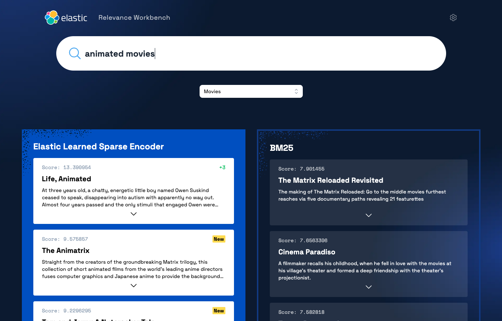
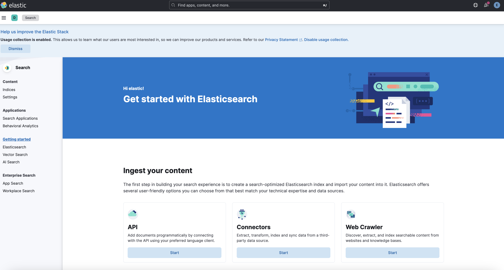
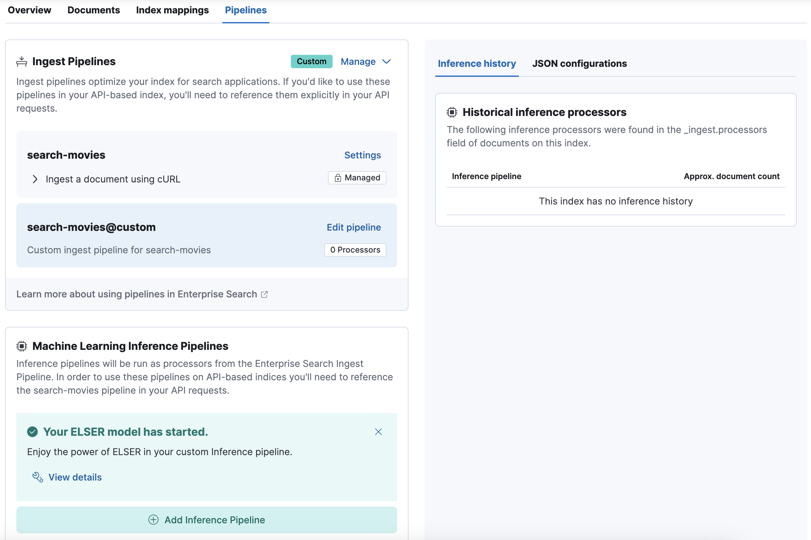
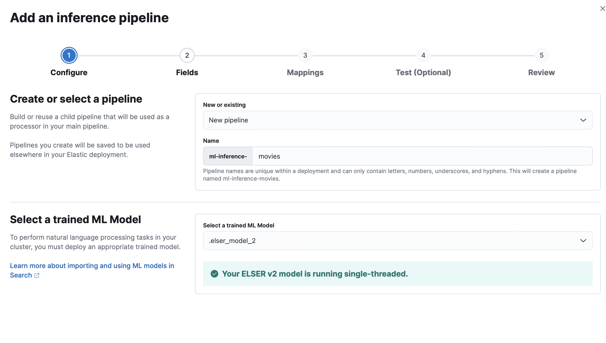
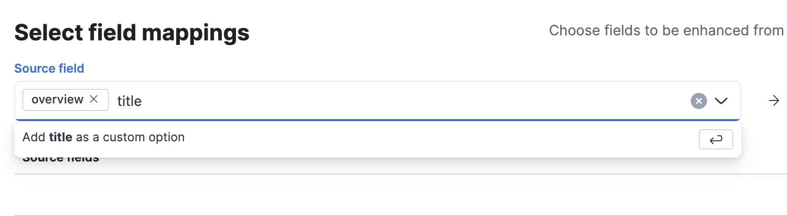
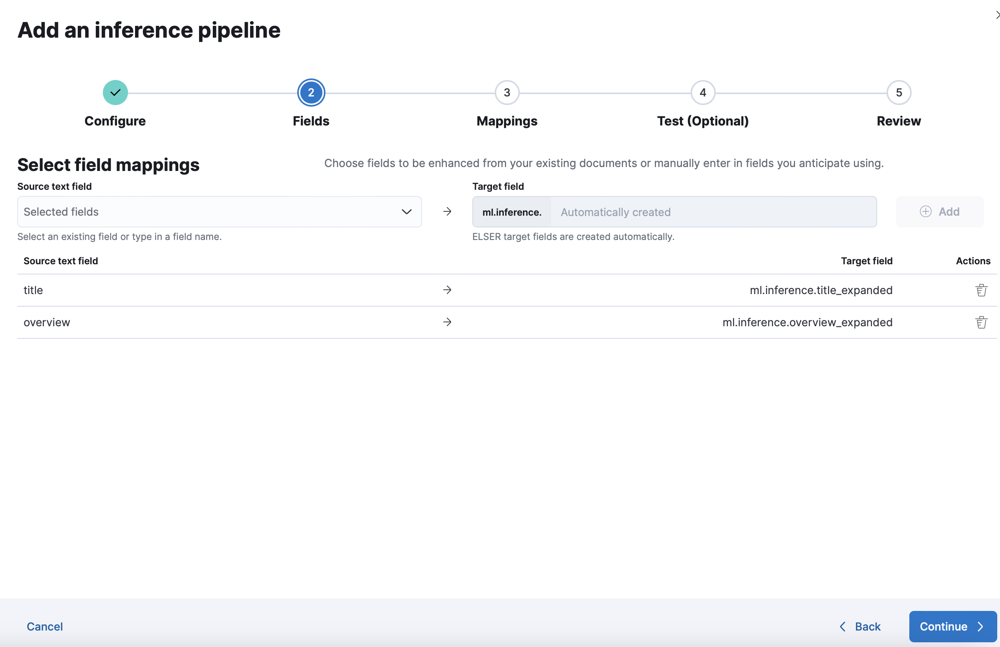

# Relevance workbench

This application allows you to compare results ranking between the [Elastic Learned Sparse EncodeR](https://www.elastic.co/guide/en/machine-learning/current/ml-nlp-elser.html) model and BM25.



You can also try with your own data by forking this repo and plugging the application into your own Elasticsearch deployment.

# Deploy with default dataset

## Pre-requisites

To run this demo successfully, you will need an Elasticsearch deployment (> 8.11) with the ELSER model deployed. The easiest way for this is to use Elastic Cloud as described in the next part but you can also deploy Elasticsearch locally.

## Deploy Elasticsearch in Elastic Cloud

If you don't have an Elastic Cloud account, you can start by signing up for a [free Elastic Cloud trial](https://cloud.elastic.co/registration?utm_source=github&utm_content=elasticsearch-labs-samples). After creating an account, you’ll have an active subscription, and you’ll be prompted to create your first deployment.

Follow the steps to Create a new deployment. For more details, refer to [Create a deployment](https://www.elastic.co/guide/en/cloud/current/ec-create-deployment.html) in the Elastic Cloud documentation.

For that demo, you will need to have an Elasticsearch deployment with Enterprise Search enabled and a ML node with at least 4Gb of memory.

Once created don't forget to save the default admin password in a safe place.

Note that, if you prefer, you can also [deploy Elasticsearch on your own infrastructure](https://www.elastic.co/guide/en/elasticsearch/reference/current/install-elasticsearch.html)

## Deploy Elastic Learned Sparse Encoder model

You can follow this [documentation](https://www.elastic.co/guide/en/machine-learning/master/ml-nlp-elser.html#download-deploy-elser) to deploy and start the model on your deployment.

## Load the data

The best approach is to use Enterprise Search to create a new index and configure the ingest pipeline to enrich the data.

From the landing page in Kibana, navigate to Search.



### Create the index

Here, click on Create an Elasticsearch index and choose the API method.

Name the index `search-movies` (notice the existing prefix `search-`), and click on Create index.

### Configure the ingest pipeline

On the index configuration screen, navigate to the Pipelines tab and click on Copy and customize.



Now click on Add Inference pipeline to configure the inference pipeline.

Name the inference pipeline `ml-inference-movies` (notice the existing prefix `ml-inference-`) and select the ELSER model. If it's not available, you can deploy it on the previous screen. Click continue.



On the next screen, add the fields `overview` and `title` as custom options.



Then click on Continue.



Click Continue to review the changes and then Create pipeline.

### Run the script to ingest data

Go to the folder `data` and run the python script `index-data.py` to ingest the movies dataset.

In order to connect it to the correct Elastic Cloud instance, we need the default admin password you saved after creating the deployment and the Cloud ID for your deployment.

The Cloud ID for your deployment can be found by navigating to the Kibana menu and clicking on the Manage this deployment link. This will take you to the infrastructure management page in Elastic Cloud. Look for the Cloud ID on that page (surrounded by a red box in the screenshot). There is a button at the end of it that you can use to copy the value to the clipboard.


```
# Skip this if you already have installed the script dependencies
python3 -m venv .venv
source .venv/bin/activate
pip install -r requirements.txt

# Run the script
python3 index-data.py --es_password=<ELASTICSEARCH_PASSWORD> --cloud_id=<CLOUD_ID>
```

- ELASTICSEARCH_PASSWORD: Use the default admin password previously saved
- CLOUD_ID: See instructions above to retrieve it

Note that by default, only subset of the dataset (100 movies) is indexed. If you're interested in indexing the whole data (7918 movies), you can select the `movies.json.gz` file by adding the option `--gzip_file=movies.json.gz` to the command line. Note that it might take up to 1 hour to index the full dataset.

## Run the application

Once the data have been successfully indexed, you can run the application to start comparing relevance models.

The application is composed of a backend Python API and a React frontend. You can run the whole application locally using Docker compose.

Edit the `docker-compose.yml` file to replace values for. Reuse the same information that you use for loading the data.

- CLOUD_ID=<CLOUD_ID>
- ELASTICSEARCH_PASSWORD=<ELASTICSEARCH_PASSWORD>

Run `docker-compose up` to start the application.

Open [localhost:3000](http://localhost:3000) to access the application.

# Use your own dataset

To use your own dataset, you first need to ingest it and then configure the backend API to use it.

## Load your own data

The first part described in the chapter below can be used similarly to load your own data.

Use Enterprise Search to create a new index and configure an ML Inference pipeline. In this case, you'll need to choose yourself the fields to generate text expansion, note that ELSER inference works across text fields, and best on shorter spans of text. Those are the fields that the relevance workbench will query.

Once the index is ready, use the same Python script to ingest the data, with additional options.

```
python3 index-data.py --es_password=<ELASTICSEARCH_PASSWORD> --cloud_id=<CLOUD_ID> --index_name=<INDEX_NAME> --gzip_file=<GZIP_FILE_NAME>
```

- ELASTICSEARCH_PASSWORD: Use the default admin password previously saved
- CLOUD_ID: You can find this information in your Elastic Cloud admin console
- INDEX_NAME: Your own custom index
- GZIP_FILE_NAME: The name of the GZIP JSON file containing your dataset. To be placed under `data` folder.

## Configure the backend API

At the beginning of the file `app-api/app.py`, you can find an object that configure the datasets to use.

By default, it looks like this:

```
datasets = {
    "movies": {
        "id": "movies",
        "label": "Movies",
        "index": "search-movies",
        "search_fields": ["title", "overview",  "keywords"],
        "elser_search_fields": ["ml.inference.overview_expanded.predicted_value", "ml.inference.title_expanded.predicted_value^0.5"],
        "result_fields": ["title", "overview"],
        "mapping_fields": {"text": "overview", "title": "title"}
    }
}
```

To add a new dataset, simply adds a new entry in the datasets object.

```
datasets = {
    "movies": {
        "id": "movies",
        "label": "Movies",
        "index": "search-movies",
        "search_fields": ["title", "overview",  "keywords"],
        "elser_search_fields": ["ml.inference.overview_expanded.predicted_value", "ml.inference.title_expanded.predicted_value^0.5"],
        "result_fields": ["title", "overview"],
        "mapping_fields": {"text": "overview", "title": "title"}
    },
    "my_custom_data": {
        "id": "my_custom_data",
        "label": "My data",
        "index": "search-custom",
        "search_fields": ["field1", "field2"],
        "elser_search_fields": ["ml.inference.field1_expanded.predicted_value", "ml.inference.field2_expanded.predicted_value^0.5"],
        "result_fields": ["field1", "field2"],
        "mapping_fields": {"text": "field1", "title": "field2"}
    }
}
```

In the configuration of the new dataset, provides the following informations:

- index: Name of the index
- search_fields: Fields to query for BM25
- elser_search_fields: Fields to query for ELSER
- result_fields: Fields to return
- mapping_fields: Mapping between returned fields and fields expected by the front-end

Then save the file `app.py` and run the application using docker-compose.

## Credits

 This product uses the TMDB API but is not endorsed or certified by TMDB.
