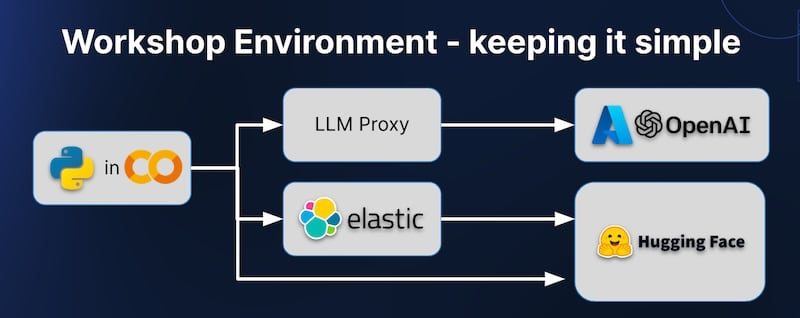

# GenAI Dev Workshop 

The Elastic Solutions Architecture and Customer Engineering teams run a three-hour hands-on workshop for technical teams starting their GenAI journeys and looking for a hands-on crash course working with LLMs and learning about building RAG solutions on their private data.

In the spirit of openness ... please find the agenda and a link to the Python notebook-based exercises. Because this workshop relies on an Elastic-managed back-end environment, the code assumes you have access to a temporary key issued by our Solutions Architecture team. Send us a [contact form](https://www.elastic.co/contact?baymax=rtp&rogue=eswt-1165-b#questions) to reach and we'd be happy to direct you to the next public run of the workshop or help you get a temp key to check out the labs on your own.

* Part 1 – Welcome and Introduction to Generative AI
  * Lab - Using Transformers
* Part 2 – Prompt Engineering and Privacy
  * Lab - Basic ChatBots
  * Lab - NER / APM in a Customer Support Prompt
* Part 3 - Vectors and Chunking
  * Lab - Understanding and Generating Vectors
* Part 4 - Search Powered AI
  * Lab - RAG Application
* Part 5 - Understanding and Monitoring Costs

### Notebook Links

[Google Colab version](https://github.com/elastic/genai-workshop-colab/tree/wave2)

[Github Codespaces version](https://github.com/elastic/genai-workshop-codespaces/tree/wave2)
