# Building Actionable AI: Automating IT Requests with Agent Builder and One Workflow

This directory contains resources and workflows for building an AI agent capable of automating laptop refresh requests for Elastic employees. It accompanies the blog post "Building Actionable AI: Automating IT Requests with Agent Builder and One Workflow".

## Contents

### Files

- **laptop_refresh_agent_instructions.ipynb**: A Jupyter Notebook containing the detailed system instructions and operating protocol for the Laptop Refresh Agent. It outlines the agent's mission, steps for user verification, eligibility checks, device selection, and request submission logic.

### Directories

#### Laptop Refresh Workflows

Contains specific YAML workflow definitions used by the Laptop Refresh Agent:

- `CasePointServiceNow.yaml`: Workflow definitions for ServiceNow interactions.
- `GetCurrentUsersData.yaml`: Workflow to retrieve current user details and asset data.
- `SubmitLaptopRefreshRequest.yaml`: Workflow to submit the final laptop refresh request to ServiceNow.

#### Try it yourself workflows

Contains generic ServiceNow workflow templates that can be used as a reference or starting point for your own automations:

- `Generic_ServiceNow_Catalog_Order.yaml`: Template for ordering items from a ServiceNow catalog.
- `Generic_ServiceNow_Create_Record.yaml`: Template for creating new records in ServiceNow.
- `Generic_ServiceNow_Get_Records.yaml`: Template for retrieving records from ServiceNow.
- `Generic_ServiceNow_Update_Record.yaml`: Template for updating existing ServiceNow records.

## Prerequisites

To successfully use these workflows, you will need the following:

- **ServiceNow Instance**: Access to a ServiceNow instance (e.g., a developer instance).
- **Elasticsearch**: An Elastic Cloud deployment or a local Elasticsearch instance.
- **Workflow Configuration**: You must update the `consts` section in the workflow YAML files with your specific environment details.
  - `snow_instance_url`: Your ServiceNow instance URL (e.g., `https://dev12345.service-now.com`).
  - `snow_auth_token`: Your ServiceNow authorization token (typically Basic Auth base64 encoded credentials).

## How to Interact

Follow these steps to set up and execute a workflow, using the provided screenshots in the `Assets` folder as a guide:

1.  **Navigate to Workflows**:
    Click on the **Workflows** tab in the interface.
    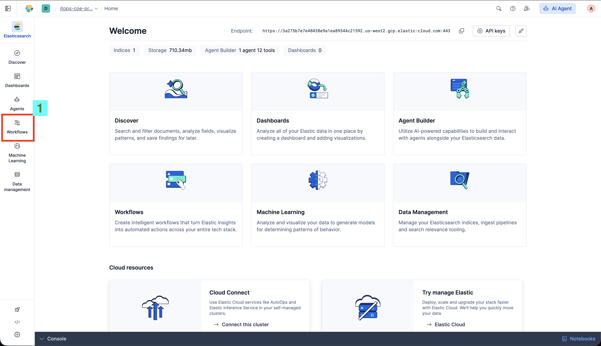

2.  **Create a New Workflow**:
    Click on the **Create a new workflow** button.
    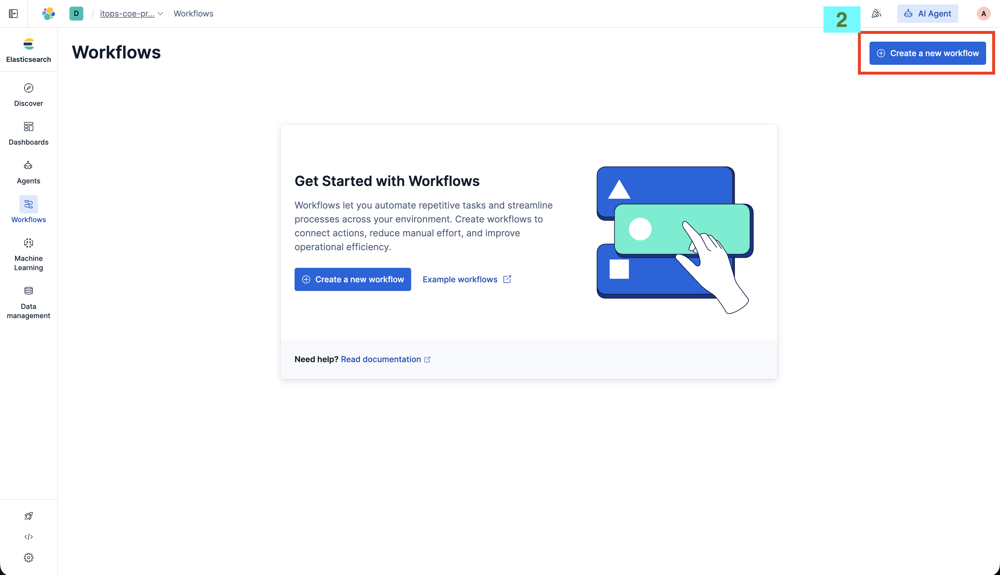

3.  **Import Workflow Definition**:
    Remove any pre-existing code in the editor and replace it with the content of one of the files from the `Try it yourself workflows` folder (e.g., `Generic_ServiceNow_Get_Records.yaml`).
    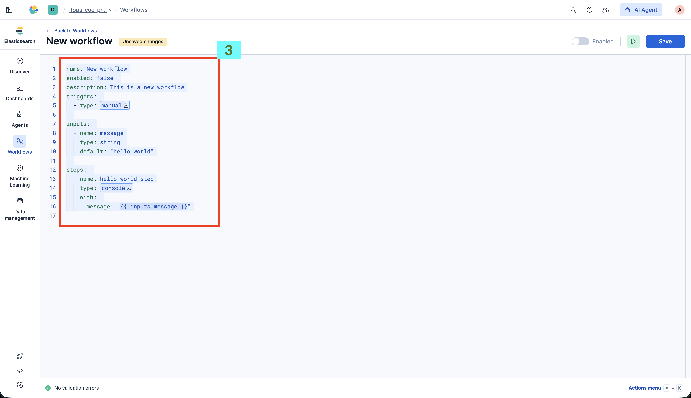

4.  **Configure and Execute**:
    - Update the **consts** values (Step 4 in the image) with your ServiceNow credentials.
    - Click the **Execute** button (Step 5 in the image) to run the workflow.
      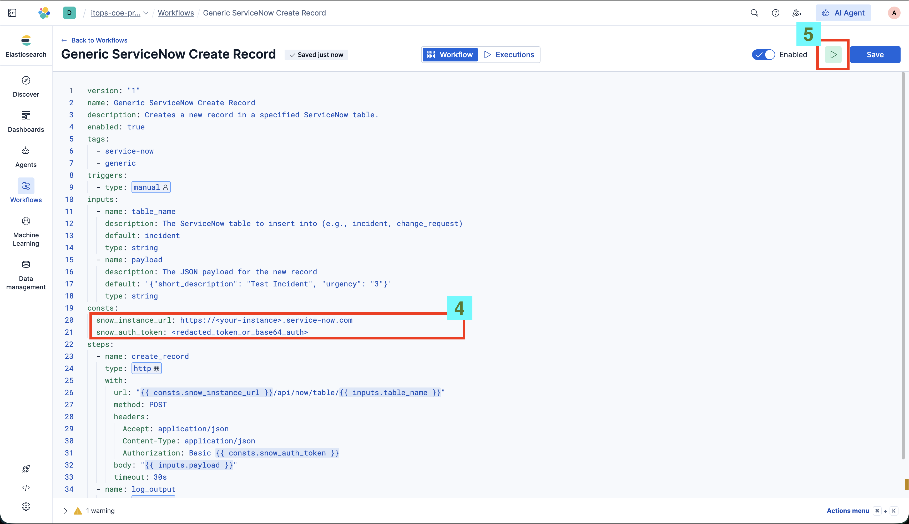

5.  **Test Workflow**:
    As shown in step 6, try changing the JSON for testing the workflow created and then click on **Run**.
    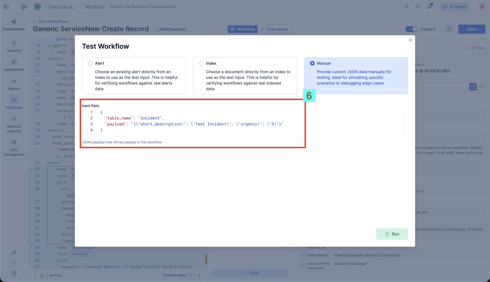

6.  **Verify Execution**:
    As displayed in step 7, the execution was successful. You'll be able to access input and output of each step.
    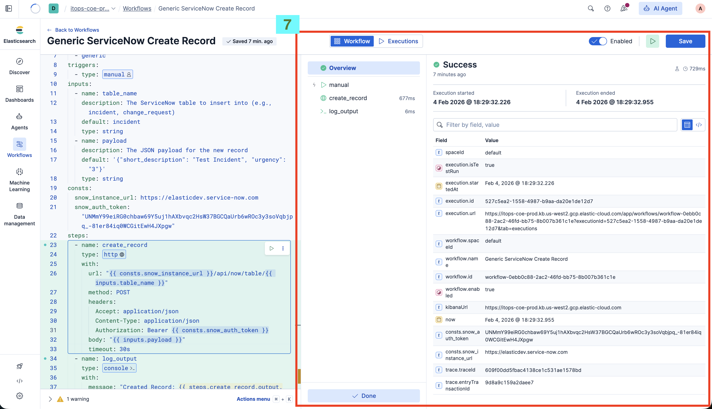

7.  **Navigate to Agents**:
    As shown in step 8, click on **Agents** from the left navigation tab. As shown in step 9, click on **View all agents**.
    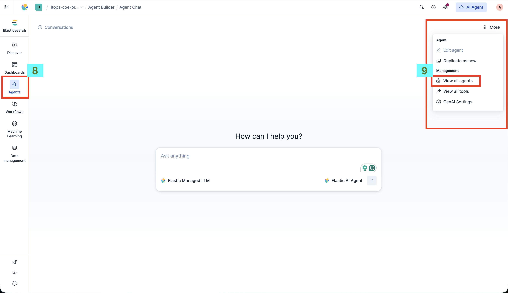

8.  **Create New Agent**:
    As shown in step 10, click on **New agent**.
    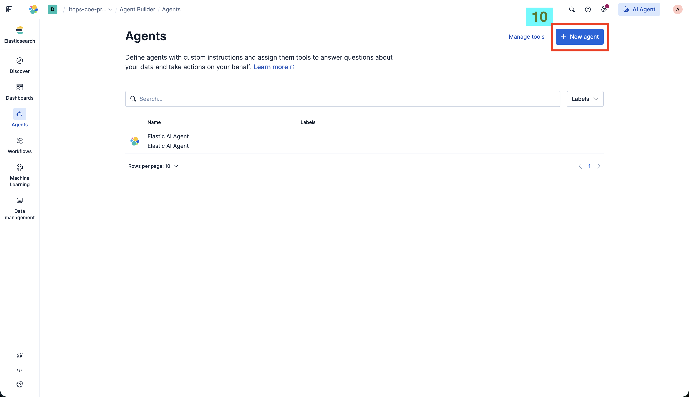

9.  **Configure Agent**:
    As shown in this image, paste the instructions from `Try it yourself Agents/service_now_utility_agent.ipynb` into the box after giving a name to the Agent. Then, as step 11 shows, click on **Save**.
    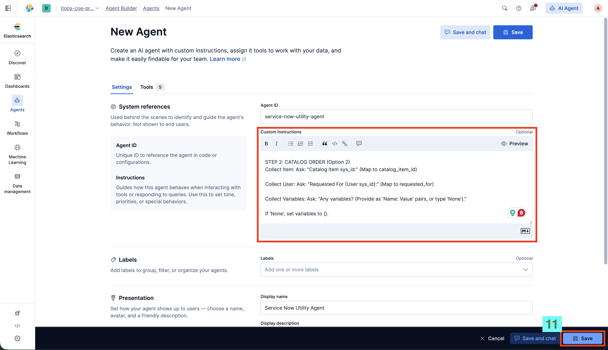

10. **Manage Tools**:
    As step 12 mentions, click on **Manage tools** and then click on **New tool**.
    

11. **Create Tool**:
    As step 13 shows, select **Workflow** in the type field. As step 14 shows, select the workflow that you have created. As shown in step 15, give a name to the tool which we are creating here, and click on **Save** based on step 16.
    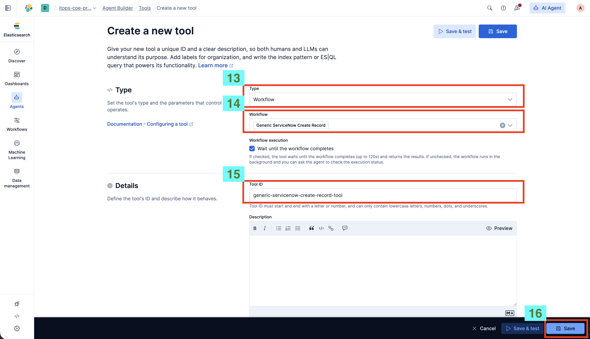

12. **Edit Agent**:
    Step 17: Now click on **Edit agent** after going to the agents section.
    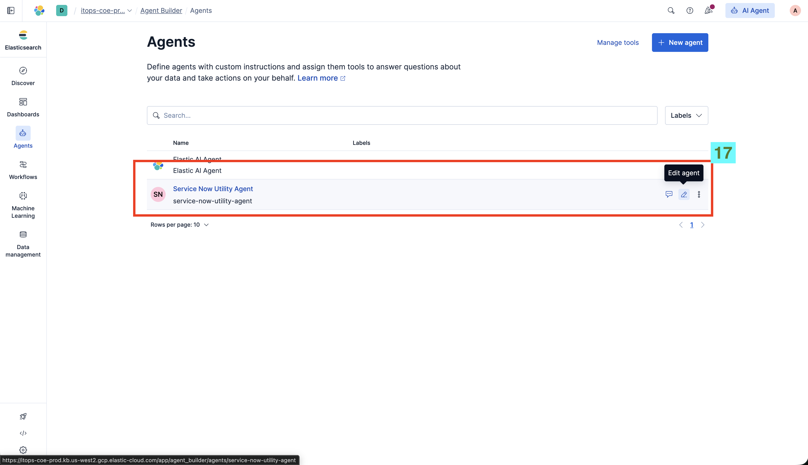

13. **Add Tools to Agent**:
    Step 18: Click on **Tools**.
    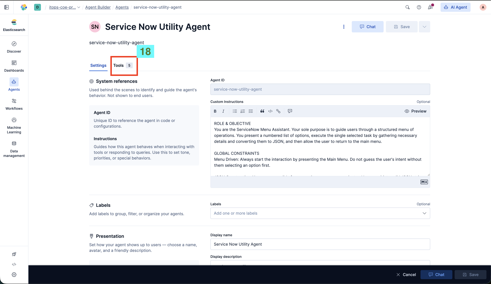

14. **Select and Save Tool**:
    Step 19: Search for the tool which you created. Step 20: Select the newly created tool. Step 21: Click on **Save**, and now you are ready to use the agent.
    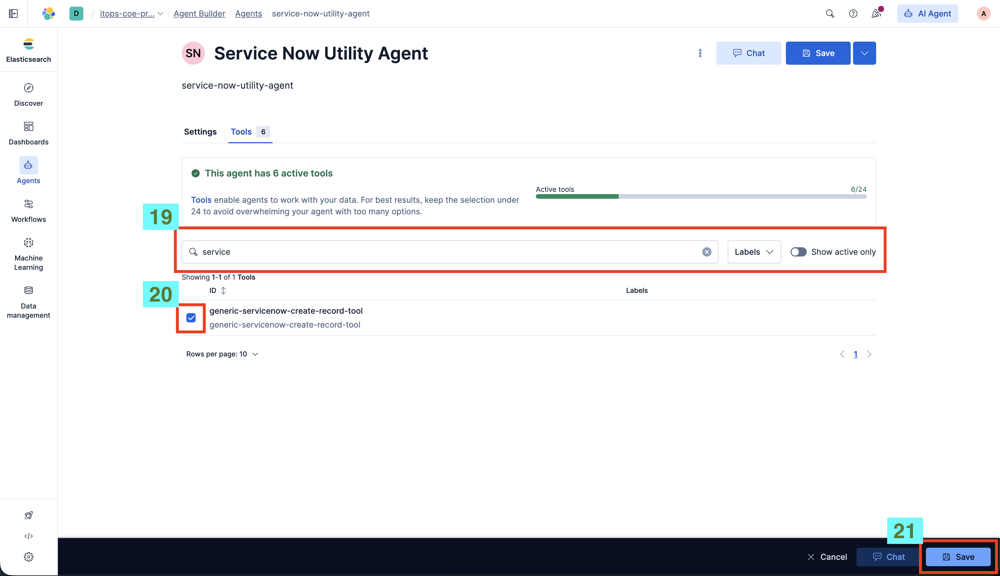

## Agent Demo

Here is the output of the agent and its interaction:
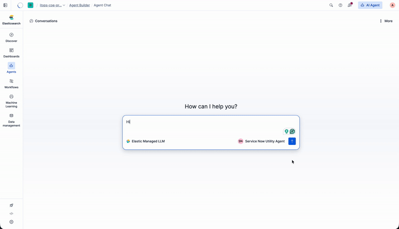
