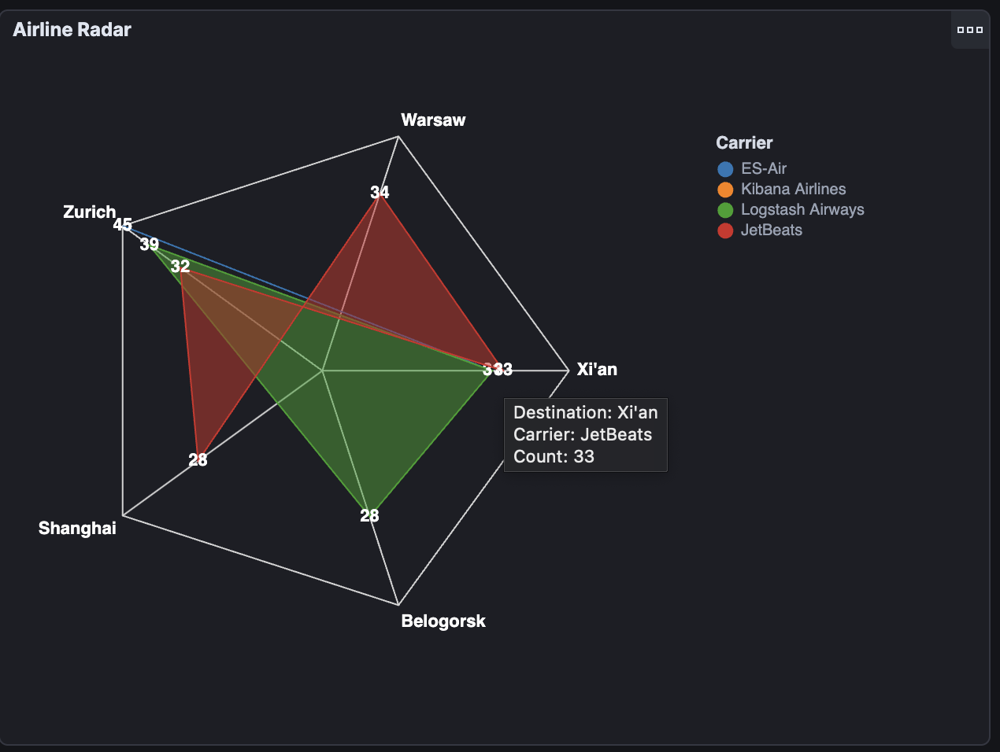

# Accompanying Content: Building Advanced Visualizations with Kibana and Vega

This folder contains example visualizations using the [Vega](https://vega.github.io/vega/) and [Vega-Lite](https://vega.github.io/vega-lite/) grammars used in the [Search Labs](https://www.elastic.co/search-labs) post **Building Advanced Visualizations with Kibana and Vega**.

## Pre-requisites

These examples make use of the **Sample flight data** dataset available in Elastic Cloud. This data can be added to your cluster using the [Add the sample data instructions in the documentation](https://www.elastic.co/guide/en/kibana/current/get-started.html#gs-get-data-into-kibana).

## Examples

The following examples are present in this folder:

`airline-cancellations-infographic.hjson` contains an example infographic visualization with image marks (source [Unsplash](https://unsplash.com/)).

`airline-radar-chart.hjson` presents an example Radar chart using an Elasticsearch aggregation.

This example is based on the Radar Chart example from the [Vega documentation](https://vega.github.io/vega/examples/radar-chart/).