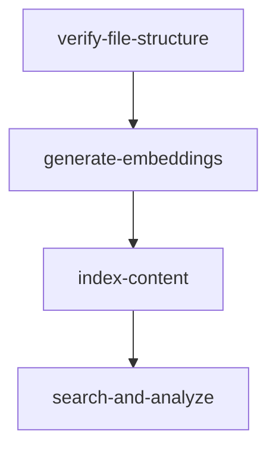

# Building a Multimodal RAG Pipeline with Elasticsearch: The Story of Gotham City

This repository contains the code for implementing a Multimodal Retrieval-Augmented Generation (RAG) system using Elasticsearch. The system processes and analyzes different types of evidence (images, audio, text, and depth maps) to solve a crime in Gotham City.

## Overview

The pipeline demonstrates how to:
- Generate unified embeddings for multiple modalities using ImageBind
- Store and search vectors efficiently in Elasticsearch
- Analyze evidence using GPT-4 to generate forensic reports

## Prerequisites

- A Docker runtime with 8GB+ free ram
  - GPU is optional, but recommended
- Elasticsearch cluster (cloud or local)
- OpenAI API key - Setup an OpenAI account and create a [secret key](https://platform.openai.com/docs/quickstart)

## Quick Start

This example runs four stages as docker compose services:



First, copy [env.example](env.example) to `.env` and fill in values noted inside.

Now, enter below to run the pipeline:
```bash
docker compose run --build --rm search-and-analyze
```

The first time takes a while to build the image and download ImageBind weights.

If you want to re-run just one stage, add `--no-deps` like this:
```bash
docker compose run --no-deps --build --rm search-and-analyze
```

## Project Structure

```
├── README.md
├── requirements.txt
├── src/
│   ├── embedding_generator.py   # ImageBind wrapper
│   ├── elastic_manager.py       # Elasticsearch operations
│   └── llm_analyzer.py         # GPT-4 integration
├── stages/
│   ├── 01-stage/              # File organization
│   ├── 02-stage/              # Embedding generation
│   ├── 03-stage/              # Elasticsearch indexing/search
│   └── 04-stage/              # Evidence analysis
└── data/                      # Sample data
    ├── images/
    ├── audios/
    ├── texts/
    └── depths/
```

## Sample Data

The repository includes sample evidence files:
- Images: Crime scene photos and security camera footage
- Audio: Suspicious sound recordings
- Text: Mysterious notes and riddles
- Depth Maps: 3D scene captures

## How It Works

1. **Evidence Collection**: Files are organized by modality in the `data/` directory
2. **Embedding Generation**: ImageBind converts each piece of evidence into a 1024-dimensional vector
3. **Vector Storage**: Elasticsearch stores embeddings with metadata for efficient retrieval
4. **Similarity Search**: New evidence is compared against the database using k-NN search
5. **Analysis**: GPT-4 analyzes the connections between evidence to identify suspects

