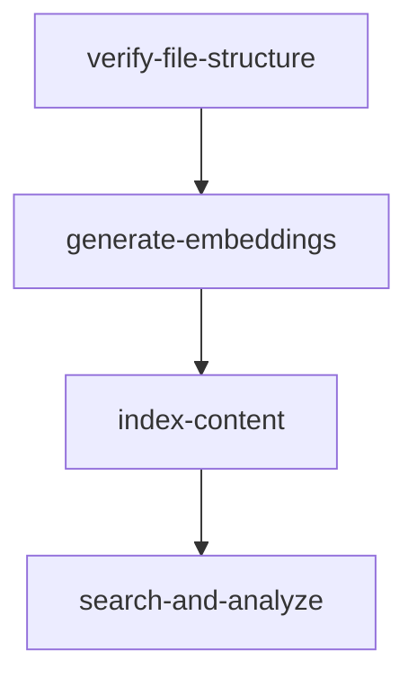

# Building a Multimodal RAG Pipeline with Elasticsearch: The Story of Gotham City

This repository contains the code for implementing a Multimodal Retrieval-Augmented Generation (RAG) system using Elasticsearch. The system processes and analyzes different types of evidence (images, audio, text, and depth maps) to solve a crime in Gotham City.

## Overview

The pipeline demonstrates how to:
- Generate unified embeddings for multiple modalities using ImageBind
- Store and search vectors efficiently in Elasticsearch
- Analyze evidence using GPT-4 to generate forensic reports

## Prerequisites

- A Docker runtime with 8GB+ free ram
  - GPU is optional, but recommended
- Elasticsearch cluster (cloud or local)
- OpenAI API key - Setup an OpenAI account and create a [secret key](https://platform.openai.com/docs/quickstart)

## Quick Start

This example runs four stages as docker compose services:



First, copy [env.example](env.example) to `.env` and fill in values noted inside.


Edit the `.env` file and fill in your credentials:

```env
# Elasticsearch Configuration
ELASTICSEARCH_URL="https://your-elasticsearch-endpoint:443"
ELASTICSEARCH_API_KEY="your-api-key"
# If not using API key, uncomment these and fill them in:
# ELASTICSEARCH_USER=elastic
# ELASTICSEARCH_PASSWORD=elastic

# OpenAI Configuration
OPENAI_API_KEY="your-openai-api-key"
```

### 2. Configure Docker Resources

The ImageBind model requires significant memory. Ensure Docker has enough resources:

- **Memory**: At least 8GB (16GB recommended)
- **Storage**: At least 10GB free space

For Docker Desktop users:
1. Open Docker Desktop settings
2. Go to Resources > Advanced
3. Increase memory allocation to at least 8GB
4. Apply & Restart

### 3. Running the Complete Pipeline

To run the entire pipeline from file structure verification to evidence analysis:

```bash
docker compose run --build --rm search-and-analyze
```

This command will:
1. Build the Docker image if needed
2. Run each stage in sequence
3. Cache the ImageBind model weights for future runs

The first run will take longer as it builds the image and downloads model weights (~4.5GB).

### 4. Running Individual Stages

If you prefer to run each stage separately:

```bash
# File structure verification
docker compose run --build --rm verify-file-structure

# Generate embeddings
docker compose run --build --rm generate-embeddings

# Index content in Elasticsearch
docker compose run --build --rm index-content

# Search and analyze evidence
docker compose run --build --rm search-and-analyze
```

To skip dependency checks when running a specific stage:

```bash
docker compose run --no-deps --build --rm search-and-analyze
```
