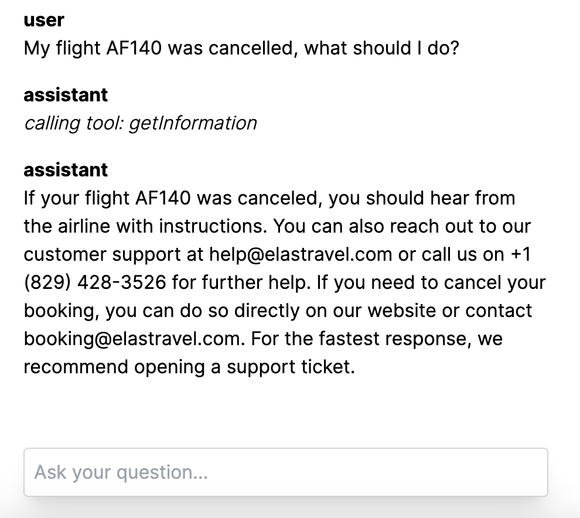
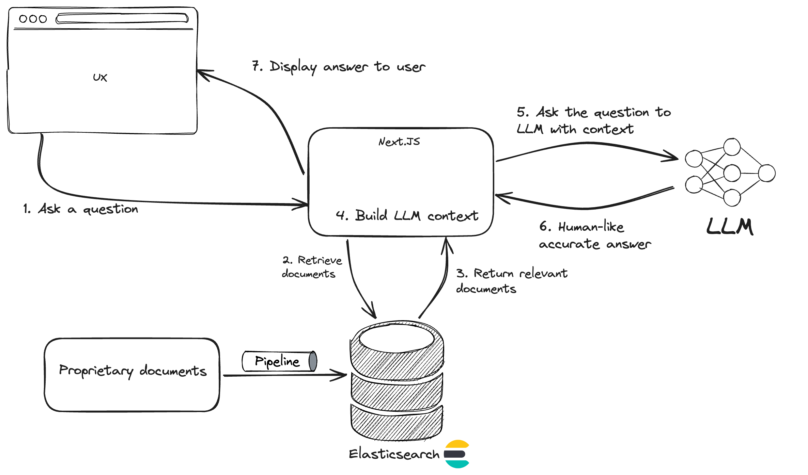

Example of AI Conversational Search using Elasticsearch, OpenAI and Vercel. 

# Pre-requisites

The application requires the following to run locally: 

- Node 18+
- Python 3.11+

You will also need an Elasticsearch serverless project or and Elasticsearch deployment version 8.15 minimum. 

Finally you need a paid account with OpenAI to get an API Key. 

# Load the data

Export the following environment variables: 
- ELASTICSEARCH_URL: You can find it in your Elasticsearch deployment
- ES_API_KEY: Your Elasticsearch API Key

Run the script ingest.py: [`python ingest.py`](ingest.py) to index the data. 

# Chat application

## High-level architecture 

The application built in Next.JS implements a AI Conversational Search using Next.JS for the stack framework, Elasticsearch as a retrieval system and OpenAI for the LLM.

In the diagram, you can see how the different components interact together when an user ask a question. 

## Install dependencies

Go to the folder `chat-example/app` and execute `yarn install` to install the project dependencies. 

## Provide environment variable

Export the following environment variables: 
- ELASTICSEARCH_URL: You can find it in your Elasticsearch deployment
- ES_API_KEY: Your Elasticsearch API Key
- OPENAI_API_KEY: Your OpenAI API Key

## Run the application 

Run the application: `yarn dev` 

Your browser should open directly to the URL: [http://localhost:3000](http://localhost:3000)

## Try it 

Ask the question: "How to get a refund?", the chat will retrieve the relevant information from Elasticsearch and OpenAI will use this to formulate an answer. 

