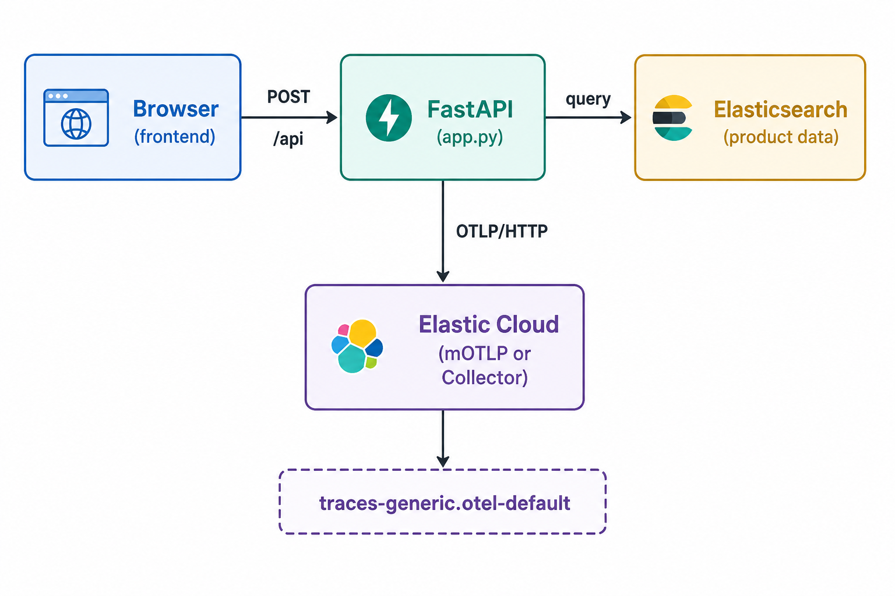

# Search Analytics with OpenTelemetry and Elastic

A minimal reference project for the blog series **"Search Analytics with OTel and Elastic"**. Clone it, set your Elastic Cloud credentials, and have search analytics data flowing in 10 minutes.

## What This Demonstrates

- **Blog 2**: Search API instrumented with OpenTelemetry — every search creates a span with `search.*` attributes, queryable via ES|QL
- **Blog 3**: Click tracking with CTR and MRR metrics
- **Blog 4**: Conversion funnel from search to purchase
- **Blog 5**: Rank features and relevance tuning — use Blog 3–4 analytics to adjust boosts in `search_queries.py`
- **Blog 6**: SLO definitions, burn rate alerting, and operational dashboards

The project starts with Blog 2 active. Blogs 3 and 4 are present but commented out — uncomment them as you progress through the series. Blog 5 uses the existing search query and product data; no new routes to enable.

## Architecture



## Prerequisites

- **Python 3.10+**
- **Elastic Cloud account** with:
  - A deployment for product data (Elasticsearch)
  - Managed OTLP endpoint enabled (for OTel-native trace ingestion)

## Quick Start

### 1. Clone and configure

```bash
git clone <repo-url>
cd search-analytics-otel
cp .env.example .env
```

Edit `.env` with your Elastic Cloud credentials:

| Variable | Where to find it |
| -------- | --------------- |
| `ELASTICSEARCH_URL` | Elastic Cloud console → your deployment → Elasticsearch endpoint |
| `ELASTIC_API_KEY` | Kibana → Stack Management → API Keys → Create |
| `OTEL_EXPORTER_OTLP_ENDPOINT` | Elastic Cloud console → Deployment → Managed OTLP endpoint |
| `OTEL_EXPORTER_OTLP_HEADERS` | `Authorization=ApiKey%20<base64-encoded-api-key>` (URL-encoded space, not a literal space) |
| `OTEL_EXPORTER_OTLP_PROTOCOL` | `http/protobuf` (required for Elastic managed OTLP) |

### 2. Setup and load data

```bash
python3 -m venv venv
source venv/bin/activate
pip install -r requirements.txt
python load_data.py
```

### 3. Start the server

```bash
python app.py
```

Open <http://localhost:8000> — search for "laptop", "headphones", "running shoes".

### 4. Generate traffic

```bash
python generate_traffic.py --blog 2 --sessions 50
```

### 5. Verify traces are flowing

In Kibana → Observability → APM, the `search-analytics-demo` service should appear within 30 seconds of traffic generation. If it doesn't show up, check:

1. `OTEL_EXPORTER_OTLP_ENDPOINT` is set to your mOTLP endpoint (not Elasticsearch URL)
2. `OTEL_EXPORTER_OTLP_HEADERS` uses `Authorization=ApiKey%20<your-key>` — the space after `ApiKey` must be `%20`, not a literal space (otherwise you get HTTP 401)
3. `OTEL_EXPORTER_OTLP_PROTOCOL=http/protobuf` is set
4. `OTEL_TRACES_SAMPLER=always_on` is set (default sampler may drop spans in some EDOT versions)

You can also confirm data landed with this ES|QL query in Kibana → Discover:

```sql
FROM traces-generic.otel-default
| WHERE name == "search" AND attributes.search.query IS NOT NULL
| KEEP @timestamp, attributes.search.query, attributes.search.result_count
| SORT @timestamp DESC
| LIMIT 5
```

### 6. Explore analytics

Then in Kibana → Discover, switch to ES|QL mode and run:

```sql
FROM traces-generic.otel-default
| WHERE name == "search"
  AND attributes.search.query IS NOT NULL
| KEEP attributes.search.query, attributes.search.result_count, attributes.search.took_ms
| SORT @timestamp DESC
| LIMIT 10
```

See `queries/blog2_search_analytics.esql` for more queries.

---

## Blog Walkthrough

### Blog 2: Search Instrumentation (Active by Default)

The `POST /api/search` endpoint in `app.py` creates an OTel span named `search` with these attributes:

| Attribute | ES\|QL Field | Description |
|-----------|------------|-------------|
| `search.query` | `attributes.search.query` | Query text |
| `search.query_id` | `attributes.search.query_id` | Unique ID (trace ID) |
| `search.result_count` | `attributes.search.result_count` | Total matching results |
| `search.took_ms` | `attributes.search.took_ms` | Elasticsearch execution time |
| `service.name` | `resource.attributes.service.name` | Service identifier (resource attr) |

**Try these queries** from `queries/blog2_search_analytics.esql`:

- Top queries by volume
- Zero-results rate
- Latency percentiles (p50/p95/p99)
- Which queries return zero results

### Blog 3: Click Tracking

**Enable it:**

1. In `app.py`: uncomment the **BLOG 3** section (click endpoint + first-click tracking)
2. In `frontend/app.js`: uncomment the **BLOG 3** sections (trackClick function + click handlers)
3. Restart the server: `python app.py`
4. Generate traffic: `python generate_traffic.py --blog 3 --sessions 50`

New attributes on click spans:

| Attribute | ES\|QL Field | Description |
|-----------|------------|-------------|
| `search.action` | `attributes.search.action` | `"click"` |
| `search.result_click_id` | `attributes.search.result_click_id` | Product ID clicked |
| `search.result_click_position` | `attributes.search.result_click_position` | Position in results (1-based) |
| `search.first_click` | `attributes.search.first_click` | `true` if first click for this query (**native boolean**) |
| `enduser.pseudo.id` | `attributes.enduser.pseudo.id` | Browser identifier (SemConv) |

**OTel-native advantage:** `search.first_click` is a **native boolean** — query it with `== true`, not `== "true"`.

**Try these queries** from `queries/blog3_click_quality.esql`:

- Overall CTR (click-through rate)
- CTR by query (find low-performing queries)
- MRR (mean reciprocal rank)
- Click position distribution

### Blog 4: Conversion Tracking

**Enable it** (requires Blog 3 to be enabled first):

1. In `app.py`: uncomment the **BLOG 4** section (cart + checkout endpoints)
2. In `frontend/app.js`: uncomment the **BLOG 4** sections (addToCart function + button handlers)
3. In `frontend/index.html`: uncomment the `.cart-btn` CSS styles and the cart button HTML in `app.js`
4. Restart the server: `python app.py`
5. Generate traffic: `python generate_traffic.py --blog 4 --sessions 100`

**Try these queries** from `queries/blog4_conversions.esql`:

- Full conversion funnel (search → click → cart → purchase)
- Revenue by query
- Most clicked products with cart rates

### Blog 5: Personalization and Relevance Tuning

**No code to uncomment.** Blog 5 closes the feedback loop between analytics (Blogs 3–4) and ranking. The companion app already ships with rank features on every product and blends them into search at query time.

**Prerequisites:**

1. Blogs 3 and 4 enabled (see above)
2. Traffic with clicks and conversions: `python generate_traffic.py --blog 4 --sessions 100`
3. In Discover, set the time picker to when traffic ran (e.g. **Last 15 minutes**)

**Where to look in the repo:**

| File | Role in Blog 5 |
| --- | --- |
| `search_queries.py` | `build_product_search()` — BM25 `multi_match` plus `rank_feature` boosts in the `"should"` clause |
| `index_mapping.json` | Defines `rank_features.popularity`, `margin_score`, `freshness`, `conversion_rate` field types |
| `products.json` | Pre-seeded rank feature values per product (demo data; in production you'd write back ES\|QL aggregates) |
| `queries/blog3_click_quality.esql` | CTR/MRR queries to find problem queries |
| `queries/blog4_conversions.esql` | Revenue and funnel queries for judgment grading |
| `queries/blog5_personalization.esql` | Judgment list and document-popularity queries from the blog |

**Try adjusting a boost:**

1. Run the problem-query ES|QL in `queries/blog5_personalization.esql` against `traces-generic.otel-default`
2. Open `search_queries.py` and find the `"should"` clause in `build_product_search()`
3. Change the `"boost"` on `rank_features.popularity` (default `2`) — e.g. to `5`
4. Restart: `python app.py`
5. Regenerate traffic: `python generate_traffic.py --blog 3 --sessions 50`
6. Compare CTR/MRR in Discover before and after

In production, you'd periodically run ES|QL to compute click popularity or conversion rate per product, then update each document's `rank_features.*` fields — the blog walks through that workflow.

### Blog 6: Search Reliability (Kibana Configuration)

No code changes needed — Blog 6 uses the data already flowing from Blogs 2-4.

**Create three SLOs** in Kibana → Observability → SLOs:

1. **Latency SLO**: APM Latency indicator, service `search-analytics-demo`, threshold 250ms, target 99%
2. **Availability SLO**: APM Availability indicator, target 99.9%
3. **Quality SLO**: Custom KQL on `traces-generic.otel-default`:
   - Good: `name: "search" AND attributes.search.result_count > 0`
   - Total: `name: "search" AND attributes.search.query: *`
   - Target: 85%

Each SLO auto-creates a burn rate alert rule. See `queries/blog6_reliability.esql` for dashboard queries.

---

## OTel-Native Field Mapping

With **OTel-native ingestion** (via Managed OTLP or EDOT Collector with `mapping.mode: otel`), attribute names are **preserved as-is** under the `attributes.*` namespace:

| OTel attribute | ES\|QL field | Type |
|---------------|-------------|------|
| `search.query` | `attributes.search.query` | keyword |
| `search.result_count` | `attributes.search.result_count` | long |
| `search.first_click` | `attributes.search.first_click` | boolean |
| `session.id` | `attributes.session.id` | keyword |
| `enduser.pseudo.id` | `attributes.enduser.pseudo.id` | keyword |

No more `labels.*` / `numeric_labels.*` split. No more boolean-as-string gotchas.

---

## Configuration

### Two-Cluster Setup (Recommended for Production)

Use separate Elastic Cloud deployments:

- **Search cluster**: hosts your product index
- **Observability cluster**: receives OTel traces, runs ES|QL analytics

This ensures observability load doesn't affect search performance.

### Single-Cluster Setup (Fine for Testing)

Point both `ELASTICSEARCH_URL` and `OTEL_EXPORTER_OTLP_ENDPOINT` to the same deployment. Everything works the same — the deployment handles both product data and OTel traces.

---

## Project Structure

```text
├── app.py                    # Tutorial focus: routes + search.* span attributes
├── otel_setup.py             # EDOT bootstrap & .env robustness (skim OK)
├── config.py                 # Elasticsearch settings from .env
├── search_queries.py         # Elasticsearch query JSON
├── es_utils.py               # load_data.py helpers (Serverless-safe indexing)
├── products.json             # Sample ecommerce catalog
├── index_mapping.json        # Index mapping with rank_features
├── load_data.py              # Index products into Elasticsearch
├── generate_traffic.py       # Simulate user sessions
├── frontend/
│   ├── index.html
│   └── app.js
├── queries/                  # ES|QL for each blog post
├── .env.example
├── requirements.txt
└── setup.sh
```

**Reading the code for the blog:** Start with `app.py` → `search` endpoint (Blog 2). Open `otel_setup.py` only if export fails; it handles Elastic Cloud header encoding and EDOT quirks, not search analytics concepts.

---

## Security Note

This project is a **demo reference implementation**. It is not production-ready:

- CORS is open (`allow_origins=["*"]`). Restrict to your domain in production.
- API keys are read from `.env`. Use a secrets manager in production.
- There is no authentication on the `/api/*` endpoints.
- Never commit a `.env` file with real credentials to version control.
